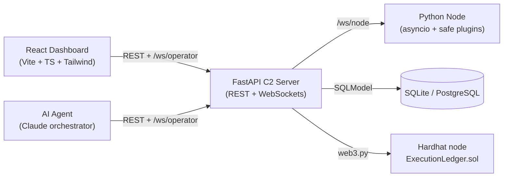
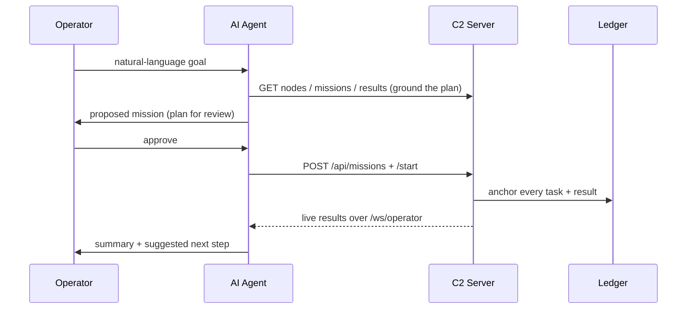

# Aligo Mission Ledger C2

> A lab-only, authorized Command & Control (C2) platform with a blockchain-backed
> **Proof-of-Execution Ledger**. Built for the Aligo Defensores Informáticos hackathon.

## Pitch

> A mission-based laboratory C2 with modular nodes and verifiable, blockchain-anchored
> auditing. Instead of being a plain remote console, it lets you create reusable missions,
> run them across multiple nodes, monitor results in real time, and register evidence
> hashes on a private blockchain to prove the operation was not tampered with.
>
> On top of that, an **AI Agent** (Claude-based orchestrator) turns natural-language
> operator intent into concrete missions — planning, chaining safe plugins across nodes,
> and reasoning over results — always under **human approval** and the same ledger and
> scope guarantees as manual operation.

## Ethical notice (read first)

This project is intended **exclusively** for closed, controlled, and **authorized**
laboratory environments. It deliberately **does not** implement real malware, evasion,
stealth, aggressive persistence, antivirus bypass, real lateral movement, exfiltration,
credential theft, or offensive execution against third parties. Nodes only run a small
**allowlist of safe plugins** and never expose an arbitrary shell. See
[`docs/security.md`](docs/security.md) and [`docs/limitations.md`](docs/limitations.md).

## Architecture



| Component | Stack | Responsibility |
|-----------|-------|----------------|
| Server | Python 3.12, FastAPI, WebSockets, SQLModel | Coordinates nodes, missions, tasks, ledger |
| Node | Python 3.12, asyncio, websockets | Connects, heartbeats, runs safe plugins |
| Agent | Python 3.12, LangGraph, Claude (`claude-opus-4-8`) | Translates operator intent into missions; orchestrates over the C2 API under human approval |
| Frontend | React, Vite, TypeScript, Tailwind | Operator dashboard + jury demo |
| Blockchain | Hardhat, Solidity | On-chain proof-of-execution ledger |
| Bridge | web3.py | Server ↔ contract integration |

Full details in [`docs/architecture.md`](docs/architecture.md).

## Agent (AI orchestration layer)

The **Agent** is the AI orchestration layer that sits where a human operator would —
it is a **client of the same C2 server**, not a privileged backdoor. It talks only over
the public surface (`REST` + `/ws/operator`) and **never communicates with nodes
directly**, so every action it drives is dispatched, hashed, and anchored in the ledger
exactly like a manual one.

**Usage & scope (bounded).** The Agent is a **lab cybersecurity expert that composes and
runs missions from the safe plugin allowlist, via the C2** — it reasons and plans like an
operator, but its hands are limited to the same safe toolset
(`system_info`, `health_check`, `echo`, `network_info`, `list_lab_directory`,
`allowed_command`). It performs **recon / enumeration / health-style** missions within lab
bounds; it does **not** run arbitrary commands and has **no capability the manual operator
lacks**. Expanding that action space is an explicit scope/ethics decision, never an
incidental one.

**What it does**

- Takes a natural-language goal from the operator (e.g. *"check the health of every
  online node and flag anything abnormal"*).
- Reads live state — connected nodes, predefined missions, prior results, ledger — to
  ground its plan.
- **Plans a mission**: selects safe plugins from the allowlist and the target nodes,
  then composes the mission steps.
- Reasons over streamed results and proposes the next step.

**Guardrails (same as manual operation)**

- **Human-in-the-loop.** The Agent only *proposes* a mission; the operator approves it in
  the dashboard before `POST /api/missions/{id}/start`. The Agent never auto-fires actions
  against nodes.
- **Bounded action space.** It can only compose missions from the **safe plugin
  allowlist** — no arbitrary shell, no capability the manual operator lacks.
- **Verifiable.** Because it acts through the server, every Agent-driven task lands in the
  blockchain-backed ledger and is independently verifiable.



> **Status:** built and integrated. The Agent backend (`agents/orchestrator`) runs as a
> separate service, and the dashboard's **Console → Ask AI** panel drives it end to end —
> plan, human approval, execution, and ledger-anchored results. See
> [`agents/orchestrator/README.md`](agents/orchestrator/README.md).

## Requirements

- Python 3.12+
- Node.js 20+ and npm
- (Optional) Docker + Docker Compose

## Quick start with Docker Compose

```bash
cp .env.example .env
docker compose up --build
# Then deploy the contract once the blockchain container is healthy:
docker compose exec blockchain npx hardhat run scripts/deploy.ts --network localhost
# Copy the printed address into .env (CONTRACT_ADDRESS=...) and restart the server:
docker compose up -d --no-deps server
```

- Dashboard: http://localhost:5173
- API docs (Swagger): http://localhost:8000/docs
- Hardhat RPC: http://localhost:8545

## Local install (without Docker)

```bash
cp .env.example .env
```

### 1. Blockchain (terminal 1)

```bash
cd blockchain
npm install
npx hardhat node            # starts a local chain on :8545
```

### 2. Deploy the contract (terminal 2)

```bash
cd blockchain
npx hardhat run scripts/deploy.ts --network localhost
# prints CONTRACT_ADDRESS -> paste it into .env
```

### 3. Server (terminal 3)

```bash
cd server
python -m pip install -r requirements.txt
uvicorn app.main:app --reload --port 8000
```

> On Windows PowerShell, set `DATABASE_URL` via `.env`; the Makefile targets assume a
> Unix-like shell, so run the commands above directly if `make` is unavailable.

### 4. Frontend (terminal 4)

```bash
cd frontend
npm install
npm run dev                 # http://localhost:5173
```

### 5. Nodes (terminal 5)

```bash
cd node
python -m pip install -r requirements.txt
python node.py --node-id node-001
# or launch a simulated fleet:
python node.py --simulate-count 3
```

## Running a mission

1. Open the dashboard and confirm nodes show **online** under **Nodes**.
2. Go to **Missions**, pick a predefined mission (e.g. *Lab Health Check*) or build one.
3. Select target nodes and start the mission.
4. Watch tasks move `pending → sent → running → success` and results stream in.
5. Open **Ledger** to see the chained events; click **Verify** on any event.

The **Demo** page provides large jury-friendly buttons for the whole flow.

## Verifying the ledger

Each important event is serialized to canonical JSON, hashed with SHA-256, chained with
`previous_hash`, stored in the DB, and anchored on-chain. Verification recomputes the local
hash and compares it with the value returned by the contract's `verifyEventHash`, showing
**verified** or **tampered**. See [`docs/blockchain-ledger.md`](docs/blockchain-ledger.md).

## Demo

A 5–7 minute script is in [`docs/demo-script.md`](docs/demo-script.md) and a recording
script in [`demo/video-script.md`](demo/video-script.md). Sample data lives in
[`demo/sample-missions.json`](demo/sample-missions.json).

Expected demo flow: start blockchain → deploy contract → start server → start frontend →
connect 2–3 nodes → see them online → create *Lab Health Check* → run across nodes →
watch live results → inspect ledger events → verify integrity → show the timeline replay.

## Documentation

- [Architecture](docs/architecture.md)
- [Agent (AI orchestration)](agents/orchestrator/README.md)
- [Protocol](docs/protocol.md)
- [Security](docs/security.md)
- [Blockchain Ledger](docs/blockchain-ledger.md)
- [Deployment](docs/deployment.md)
- [Demo Script](docs/demo-script.md)
- [Scoring Strategy](docs/scoring-strategy.md)
- [Limitations](docs/limitations.md)

## Known limitations

Not for production. Local blockchain is for demonstration only. The shared token is not a
substitute for real PKI. SQLite is the default store. Plugins are intentionally limited for
safety. See [`docs/limitations.md`](docs/limitations.md).

## License / use

Authorized laboratory use only. Do not deploy against systems you do not own or are not
explicitly authorized to test.
