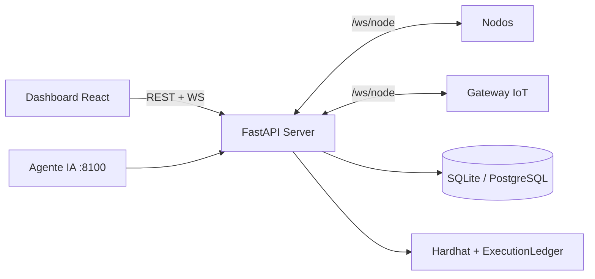

# Aligo Mission Ledger C2 — Guía técnica completa

> Documento de entrega para jurados — hackathon **Aligo Defensores Informáticos**.  
> Uso exclusivo en laboratorio autorizado. Equipo **UNcontrolled**.

---

## 1. Resumen ejecutivo

**Aligo Mission Ledger C2** es un C2 orientado a **misiones** para entornos de laboratorio.
Permite definir misiones reutilizables, orquestar nodos modulares (cómputo + IoT simulado),
recibir resultados en tiempo real y registrar cada evento importante en un ledger encadenado
cuyos hashes se anclan en una blockchain privada (Hardhat).

**Frase para jurado (30 s):**

> *"Convertimos operaciones de laboratorio en evidencia auditable. Cada plugin ejecutado
> genera un paquete de prueba de ejecución con hash encadenado y anclaje on-chain, para
> demostrar que nadie modificó los resultados después del hecho."*

**Diferenciador vs C2 clásico:**

| C2 clásico | Mission Ledger C2 |
|------------|-------------------|
| Comandos ad-hoc | **Misiones** versionables |
| Logs editables | **Hashes** anclados on-chain |
| Shell remoto | **Plugins** en allowlist |
| Un tipo de endpoint | Nodos de cómputo + **gateway IoT** |
| Sin prueba criptográfica | **Verify** en un clic |

---

## 2. Terminología

| Término | Significado |
|---------|-------------|
| **Nodo** | Agente remoto (`node.py`) conectado por WebSocket |
| **Plugin** | Capacidad segura única (`system_info`, `health_check`, …) |
| **Misión** | Plan reutilizable = lista de pasos `{plugin, args}` |
| **Tarea** | Una ejecución de plugin en un nodo |
| **Ledger** | Registro append-only encadenado por hashes |
| **Anclar** | Escribir hash del evento en `ExecutionLedger.sol` |
| **Operador** | Humano en el dashboard |
| **Agente** | Orquestador IA (Claude) — mismo API, aprobación humana |

---

## 3. Arquitectura y componentes



| Componente | Stack | Rol |
|------------|-------|-----|
| `server/` | FastAPI, SQLModel, web3.py | API REST, WebSockets, persistencia, ledger, OSINT |
| `node/` | asyncio, websockets | Plugins seguros, heartbeats, firma Ed25519 |
| `frontend/` | React, Vite, Tailwind, i18n ES/EN | Dashboard del operador |
| `blockchain/` | Solidity, Hardhat | Ancla hashes de eventos |
| `agents/orchestrator/` | LangGraph, Claude | Planificación con human-in-the-loop |

**Flujo misión → tarea → ledger:**

1. El operador crea o elige una misión (lista de pasos `{plugin, args}`).
2. Al iniciar, el servidor genera tareas (paso × nodo) y las despacha por WebSocket.
3. Cada transición se persiste, se emite por `/ws/operator` y se ancla en el ledger.
4. Estados de tarea: `pending → sent → success | failed | timeout | blocked_by_policy`.

**Manejo de errores:** mensajes WebSocket con tamaño máximo y validación Pydantic; token
inválido en registro → rechazo; nodo offline al despachar → tarea `failed` (las misiones no
cuelgan); cadena caída → eventos `pending_chain` sin detener el sistema.

---

## 4. Protocolo nodo ↔ servidor

Transporte: **WebSocket** `/ws/node`, JSON versión `1.0`.

| Tipo | Dirección | Propósito |
|------|-----------|-----------|
| `register` | nodo → servidor | Autenticación con token compartido |
| `register_ack` | servidor → nodo | Aceptación |
| `heartbeat` | nodo → servidor | Liveness (~5 s) |
| `task` | servidor → nodo | Ejecutar plugin |
| `result` | nodo → servidor | Salida estructurada + firma Ed25519 |
| `error` | ambos | Error no fatal |

Canal operador `/ws/operator`: `node_update`, `task_update`, `mission_update`,
`vulnerability_scan_update`, `vulnerability_issue`, etc.

Monitor de heartbeat: warning ~15 s, offline ~30 s (configurable).

---

## 5. Ledger — prueba de ejecución

**Problema:** un C2 tradicional guarda logs editables. **Solución:** anclar SHA-256 de cada
evento en una cadena append-only.

**Mecanismo (tres capas):**

1. **Hashing canónico** — JSON con claves ordenadas → SHA-256 (`core/hashing.py`).
2. **Encadenamiento** — cada evento guarda `previous_hash` del anterior (`ledger_service.py`).
3. **Anclaje on-chain** — `registerEvent()` en `ExecutionLedger.sol` vía web3.py.

**On-chain vs off-chain:**

| On-chain | Base de datos |
|----------|---------------|
| `eventId`, hashes, metadatos mínimos | Payload canónico, stdout, tx_hash, timestamps |

No se escribe salida cruda ni datos sensibles en la cadena.

**Estados de verificación:**

| Estado | Significado |
|--------|-------------|
| `verified` | Hash local = on-chain |
| `tampered` | Divergencia detectada |
| `pending_chain` | Aún no anclado o cadena no disponible |
| `local_only` | Ledger deshabilitado |

**Operaciones:** anclar pendientes desde **Ledger** o `POST /api/ledger/anchor-pending`;
verificar con `POST /api/ledger/events/{id}/verify` (recalcula hash local, compara con
on-chain).

**Contrato** `ExecutionLedger.sol`: `registerEvent`, `getEvent`, `verifyEventHash`,
`eventExists`.

`CONTRACT_ADDRESS` se lee de `.env` o `deployment.json`. Reiniciar Hardhat borra estado
on-chain; el servidor reconcilia con `/api/ledger/sync`.

---

## 6. Seguridad y limitaciones

**Modelo de amenazas (laboratorio):** contención (no shell remoto), integridad auditable,
robustez ante entrada malformada. Fuera de alcance: PKI real, multi-tenant, capacidades
ofensivas.

**Decisiones clave:**

- **Sin shell arbitrario** — solo plugins del registro; `allowed_command` limitado a
  `whoami`, `hostname`, `pwd`, `date`.
- **Allowlist en tres capas** — validación Pydantic en API, registro en nodo, políticas por
  nodo.
- **Sandbox** — `list_lab_directory` confinado a `node/lab_workspace/`.
- **Autenticación** — token compartido `NODE_SHARED_TOKEN` (no PKI/mTLS).
- **TLS** — `python dev.py` usa HTTPS/WSS con cert autofirmado; Docker/cloud usan HTTP.
- **Agente IA** — cliente de la misma API; herramientas con compuerta requieren aprobación
  humana; misma allowlist que el operador manual.

**Lo que NO hace:** malware, evasión, persistencia, bypass AV, movimiento lateral real,
escaneo ofensivo, robo de credenciales, exfiltración.

**Limitaciones honestas:** demo de hackathon (no producción); cadena Hardhat local; token
estático; SQLite por defecto; servidor monolítico; plugins intencionalmente limitados;
OSINT/vuln scan son indicativos, no auditoría formal.

---

## 7. Nodos y políticas

Un nodo aparece en el inventario al conectarse por WebSocket. Campos relevantes: `id`,
`alias`, `tags`, `group`, `node_type` (`real`, `simulated`, `ai_analyst`), `policy_id`,
`enabled`, salud 0–100 (heartbeat, éxito, latencia, errores).

**Políticas predefinidas:**

| ID | Plugins permitidos |
|----|-------------------|
| `basic_safe` | `health_check`, `system_info`, `echo` |
| `lab_file_audit` | + `list_lab_directory` |
| `demo_full` | + `network_info`, `allowed_command` |
| `iot_demo_policy` | Plugins IoT del gateway |

Si un plugin no está permitido: tarea `blocked_by_policy`, evento ledger `PLUGIN_BLOCKED`,
API 403. Demo: asignar `basic_safe` → intentar `network_info` → bloqueo → cambiar a
`demo_full` → éxito.

---

## 8. IoT simulado

Gateway software (`gateway-sim-001`) conectado por el mismo WebSocket que los nodos de
cómputo. **No requiere hardware físico.** Solo el gateway se registra en el C2; los
subdispositivos viven en memoria dentro del proceso del gateway.

```
C2 Server → WebSocket → gateway-sim-001 → subdispositivos simulados
```

| ID | Tipo | Estado simulado |
|----|------|-----------------|
| `led-001` | actuador | on/off, brillo, parpadeo |
| `temp-001` | sensor | temperatura |
| `humidity-001` | sensor | humedad |
| `motion-001` | sensor | movimiento |
| `light-001` | sensor | lux |

Telemetría actualizada ~cada 2 s en `iot_snapshot` del heartbeat.

**Plugins IoT:**

- Gateway: `gateway_health`, `list_devices`, `get_device_info`, `get_gateway_snapshot`
- Por dispositivo (`device_id` en args): `read_temperature`, `read_humidity`, `read_motion`,
  `read_light`, `led_on`, `led_off`, `led_blink`, `led_set_brightness`

**UI:** página **IoT Lab** (telemetría, circuito, acciones rápidas LED), **Topology** (rama
IoT bajo el gateway). API: `GET /api/iot/lab`, `POST /api/iot/actions`.

**Misiones predefinidas:** IoT Lab Health Check, Environmental Snapshot, LED Proof Mission,
Hybrid Mission (pasos de cómputo + IoT con `node_id` por paso).

**Evidencia IoT:** resultados con `metadata.evidence_type = iot_action`; mismo tratamiento
en modal de evidencia y ledger que tareas de cómputo.

**Arranque:** `python dev.py` levanta el gateway localmente; en Docker/cloud el servicio
`iot-gateway` en `docker-compose.yml`.

---

## 9. Agente de IA

Servicio separado (`agents/orchestrator`, puerto 8100). Grafo LangGraph estilo ReAct:

- **Herramientas de lectura** sin restricción: listar nodos, misiones, verificar ledger.
- **Escritura con compuerta** (`start_mission`, etc.): `interrupt()` hasta aprobación humana
  en el dashboard.
- **Nunca** habla con nodos directamente — solo REST + `/ws/operator` como cualquier
  operador.

Panel **Console → Ask AI**. Cada acción del agente pasa por el mismo ledger que una
operación manual.

---

## 10. Vulnerabilidades (módulo OSINT)

Página **Vulnerabilities** (`/vulnerabilities`). Recon lab-safe + correlación OSINT
**solo en el servidor** (los nodos nunca hacen peticiones externas).

| Fase | Descripción |
|------|-------------|
| Disparo | Botón manual o cron diario (desactivado por defecto) |
| Recon | `health_check`, `system_info`, `network_info`, `list_lab_directory` |
| Hechos | Parseo de stdout JSON por nodo |
| OSINT | NVD, OSV, CISA KEV, Hacker News, Stack Exchange, GitHub, Reddit, X |
| Issues | Severidad, fuente, URL de evidencia (solo http/https) |
| Reporte | Export JSON/Markdown |

**Fuentes OSINT** (tokens opcionales vía variables de entorno; sin tokens funcionan
NVD/OSV/KEV/HN/Reddit con límites de tasa):

| Fuente | Token | Notas |
|--------|-------|-------|
| NVD | Opcional | Búsqueda CVE por palabra clave |
| OSV | No | Paquete/versión Python |
| CISA KEV | No | CVE explotados → severidad crítica |
| Hacker News | No | Algolia |
| Stack Exchange Security | Opcional | |
| GitHub / GHSA | Opcional | Issues y advisories |
| Reddit | No | API pública |
| X | Opcional | Omitido sin token |

**Heurísticas locales:** Windows sin parches, Python EOL, gap de política de red, memoria
baja.

**Límites:** no escanea puertos ni explota; hallazgos **indicativos**, no auditoría formal.

**API:** `GET/POST /api/vulnerabilities/scans`, `GET /api/vulnerabilities/issues`,
`GET /api/vulnerabilities/scans/{id}/report?format=json|markdown`.

**WebSocket:** `vulnerability_scan_update`, `vulnerability_issue`.

---

## 11. Evidencia y operación

**Modal de evidencia de tarea** — paquete de prueba de ejecución: misión, nodo, plugin,
args, stdout/stderr, duración, `local_hash`, `previous_hash`, estado on-chain. Acciones:
verificar integridad, copiar/exportar JSON, ir al ledger. `GET /api/tasks/{id}/evidence`.

**Consola** (`/console`) — no es shell remoto. Mini-lenguaje seguro:

```text
run health_check on node-001
run system_info on all
```

**Reportes de misión** — export JSON/MD desde **Missions** con metadatos, tareas,
resultados, hashes y timeline. `GET /api/missions/{id}/report`.

**Demo de alteración (lab):** ejecutar misión → anclar en ledger →
`POST /api/demo/simulate-tamper` → verificar → estado `tampered`. Solo muta copia local;
la cadena permanece inmutable.

Al ejecutar una misión desde la biblioteca, un **modal de resumen** muestra inicio, fin,
tareas con timestamps y enlace a evidencia por tarea.

---

## 12. Interfaz del operador

| Página | Función |
|--------|---------|
| Dashboard | Resumen de flota y cadena |
| Nodes | Registro, filtros, detalle, políticas |
| Topology | Mapa operador → servidor → nodos → blockchain + IoT |
| Missions | Biblioteca con buscador, builder, modal de ejecución, actividad |
| Console | Comandos seguros + Ask AI |
| Ledger | Eventos, anclar pendientes, verificar |
| IoT Lab | Telemetría, circuito, acciones rápidas |
| Vulnerabilities | Scans, issues, export |

Interfaz bilingüe (español / inglés). Sidebar visible por defecto en desktop.

---

## 13. Ejecución y despliegue

**Local (recomendado):**

```bash
cp .env.example .env
python dev.py
```

Dashboard: https://127.0.0.1:5173 — API: https://127.0.0.1:8000/docs

**Docker Compose:**

```bash
docker compose up --build
# Desplegar contrato y reiniciar server con CONTRACT_ADDRESS
```

Servicios: `blockchain`, `server`, `frontend`, `node-1`, `node-2`, `iot-gateway`.

**Google Cloud (demo):** VM Compute Engine con el mismo stack vía Terraform
(`infrastructure/`). Actualizar sin tocar blockchain:

```bash
sudo bash /opt/aligo-c2/infrastructure/update.sh main
```

**Demo en cloud:** http://34.44.10.224:5173 (VM `aligo-c2-vm`, proyecto `aligo-500700`).

---

## 14. Guión de demo (~5 min)

| Tiempo | Acción | Mensaje clave |
|--------|--------|---------------|
| 0:00 | Dashboard + cadena | C2 de lab con evidencia verificable on-chain |
| 0:30 | Topology | Operador, servidor, nodos, blockchain, rama IoT |
| 1:00 | Nodes online | Heartbeats, políticas, salud explicable |
| 1:30 | Missions → Lab Health Check | Misión reutilizable multi-nodo |
| 2:30 | Evidencia de tarea | Plugin, args, stdout, hash encadenado |
| 3:00 | Console + política | Bloqueo `network_info` con `basic_safe` |
| 3:30 | Ledger → anclar → verificar | Integridad confirmada on-chain |
| 4:00 | Demo tamper → verify | Estado `tampered` ante alteración local |
| 4:30 | Export reporte MD | Dossier para el jurado |
| 5:00 | IoT Lab (opcional) | Gateway simulado, mismo modelo de evidencia |
| — | Vulnerabilities (opcional) | Recon lab-safe + OSINT indicativo |

---

## Equipo UNcontrolled

Yulian Bedoya · Alejandro Feria · Marycielo Berrio · Juan Fernando Quintero · Yulieth Urrego
