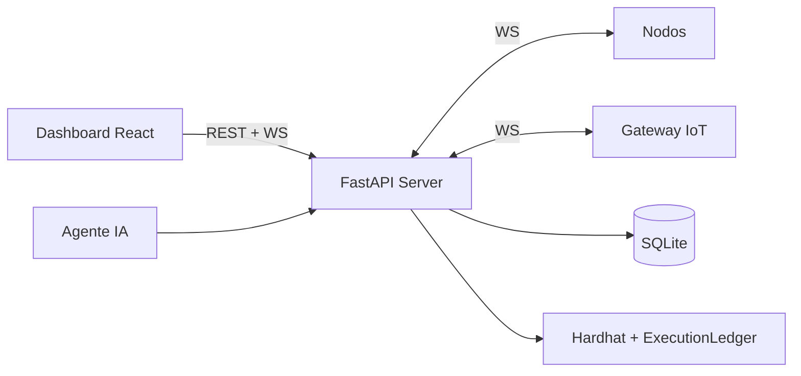

# Aligo Mission Ledger C2 — Guía técnica completa

> Documento de entrega para jurados — hackathon **Aligo Defensores Informáticos**.  
> Uso exclusivo en laboratorio autorizado. Equipo **UNcontrolled**.

---

## 1. Resumen ejecutivo

**Aligo Mission Ledger C2** es un C2 orientado a **misiones** para entornos de laboratorio.
Permite definir misiones reutilizables, orquestar nodos modulares (cómputo + IoT simulado),
recibir resultados en tiempo real y registrar cada evento importante en un ledger encadenado
cuyos hashes se anclan en una blockchain privada (Hardhat).

**Frase para jurado (30 s):**

> *"Convertimos operaciones de laboratorio en evidencia auditable. Cada plugin ejecutado
> genera un paquete de prueba de ejecución con hash encadenado y anclaje on-chain, para
> demostrar que nadie modificó los resultados después del hecho."*

**Diferenciador vs C2 clásico:**

| C2 clásico | Mission Ledger C2 |
|------------|-------------------|
| Comandos ad-hoc | **Misiones** versionables |
| Logs editables | **Hashes** anclados on-chain |
| Shell remoto | **Plugins** en allowlist |
| Un tipo de endpoint | Nodos + **gateway IoT** |
| Sin prueba criptográfica | **Verify** en un clic |

---

## 2. Terminología

| Término | Significado |
|---------|-------------|
| **Nodo** | Agente remoto (`node.py`) conectado por WebSocket |
| **Plugin** | Capacidad segura única (`system_info`, `health_check`, …) |
| **Misión** | Plan reutilizable = lista de pasos `{plugin, args}` |
| **Tarea** | Una ejecución de plugin en un nodo |
| **Ledger** | Registro append-only encadenado por hashes |
| **Anclar** | Escribir hash del evento en `ExecutionLedger.sol` |
| **Operador** | Humano en el dashboard |
| **Agente** | Orquestador IA (Claude) — mismo API, aprobación humana |

---

## 3. Arquitectura y componentes



| Componente | Stack | Rol |
|------------|-------|-----|
| `server/` | FastAPI, SQLModel, web3.py | API, WebSockets, ledger, OSINT vuln |
| `node/` | asyncio, websockets | Plugins seguros, firma Ed25519 |
| `frontend/` | React, Vite, Tailwind, i18n ES/EN | Dashboard operador |
| `blockchain/` | Solidity, Hardhat | Ancla hashes |
| `agents/orchestrator/` | LangGraph, Claude | Planificación con human-in-the-loop |

Detalle: [`arquitectura.md`](arquitectura.md).

---

## 4. Protocolo nodo ↔ servidor

WebSocket `/ws/node`, JSON v1.0:

`register` → `register_ack` → `heartbeat` (ciclo) + `task` → `result`

- Autenticación: token compartido + clave pública del nodo
- Monitor de heartbeat: warning ~15 s, offline ~30 s
- Canal operador `/ws/operator`: actualizaciones en vivo + eventos de vulnerabilidades

---

## 5. Ledger — prueba de ejecución

1. **JSON canónico** → SHA-256 (`core/hashing.py`)
2. **Encadenamiento** `previous_hash` (`ledger_service.py`)
3. **Anclaje** on-chain vía `contract_client.py` → `ExecutionLedger.sol`

Verificación: recalcula hash local vs on-chain → `verified` | `tampered` | `pending_chain`.

Solo hashes y metadatos mínimos on-chain; stdout completo queda off-chain.

Detalle: [`ledger.md`](ledger.md).

---

## 6. Seguridad

- **Sin shell remoto** — solo plugins del registro
- **Allowlist** en servidor y nodo; `allowed_command` limitado a 4 comandos inofensivos
- **Políticas por nodo** — capa adicional antes del dispatch
- **Sandbox** en `list_lab_directory`
- **Firma Ed25519** en resultados del nodo
- **Agente IA** — cliente de API, herramientas con compuerta, misma allowlist

Detalle: [`seguridad.md`](seguridad.md).

---

## 7. Nodos y políticas

Inventario en **Nodes**: alias, grupo, tags, `node_type`, política, salud 0–100.

Políticas: `basic_safe`, `lab_file_audit`, `demo_full`, `iot_demo_policy`.

Bloqueo → `blocked_by_policy` + evento `PLUGIN_BLOCKED`.

Detalle: [`nodos.md`](nodos.md).

---

## 8. IoT simulado

Gateway `gateway-sim-001` con subdispositivos en memoria (LED, sensores). Misma evidencia
y ledger que nodos de cómputo. UI: **IoT Lab**, **Topology**.

Misiones híbridas con `node_id` por paso.

Detalle: [`iot.md`](iot.md).

---

## 9. Agente de IA

Servicio separado (`agents/orchestrator`, puerto 8100). Grafo LangGraph:

- Herramientas de lectura sin restricción (listar nodos, misiones, verificar ledger)
- Escritura con compuerta (`start_mission`, etc.) → `interrupt()` hasta aprobación humana
- **Nunca** habla con nodos directamente

Panel **Console → Ask AI** en el dashboard.

---

## 10. Vulnerabilidades (módulo OSINT)

Página **Vulnerabilities** (`/vulnerabilities`):

| Fase | Descripción |
|------|-------------|
| Trigger | Manual o cron (off por defecto) |
| Recon | Plugins lab-safe en todos los nodos online |
| Facts | Parseo de stdout JSON por nodo |
| OSINT | NVD, OSV, CISA KEV, HN, SE, GitHub, Reddit, X — **solo servidor** |
| Issues | Severidad, fuente, URL de evidencia sanitizada |
| Report | Export JSON/MD |

**No** escanea puertos ni explota vulnerabilidades. Hallazgos **indicativos**.

Heurísticas locales: Windows sin parches, Python EOL, gap de política de red, memoria baja.

API: `/api/vulnerabilities/scans`, `/issues`, report export.  
WS: `vulnerability_scan_update`, `vulnerability_issue`.

Detalle: [`vulnerabilidades.md`](vulnerabilidades.md).

---

## 11. Evidencia y operación

- **Modal de evidencia** — plugin, args, stdout, hashes, verify
- **Console** — mini-lenguaje seguro (`run health_check on all`)
- **Reportes** — export JSON/MD por misión
- **Demo tamper** — `POST /api/demo/simulate-tamper` + verify → `tampered`

Detalle: [`evidencia.md`](evidencia.md).

---

## 12. Interfaz del operador

| Página | Función |
|--------|---------|
| Dashboard | Resumen de flota y cadena |
| Nodes | Registro, filtros, detalle |
| Topology | Mapa operador → servidor → nodos → blockchain + IoT |
| Missions | Biblioteca, builder, actividad de tareas |
| Console | Comandos seguros + Ask AI |
| Ledger | Eventos, anclar, verificar |
| IoT Lab | Telemetría y circuito simulado |
| Vulnerabilities | Scans, issues, export |

i18n: español e inglés.

---

## 13. Ejecución

```bash
cp .env.example .env
python dev.py
```

- Dashboard: https://127.0.0.1:5173  
- API: https://127.0.0.1:8000/docs  

Alternativas: Docker Compose, Google Cloud VM (`infrastructure/`). Ver [`despliegue.md`](despliegue.md).

**Cloud actual (demo):** VM `aligo-c2-vm` en GCP — `http://34.44.10.224:5173`

---

## 14. Demo para jurado

Guión paso a paso en [`demo.md`](demo.md). Flujo recomendado:

1. Nodos online → misión Lab Health Check  
2. Evidencia + verificar ledger  
3. Política bloqueando plugin  
4. (Opcional) IoT Lab + vulnerabilidades  

---

## 15. Limitaciones

- No producción; token compartido; cadena Hardhat local
- Plugins limitados por diseño ético
- OSINT y vuln scan son demostrativos, no auditoría formal
- SQLite por defecto; servidor monolítico

---

## 16. Índice de documentación

| Doc | Tema |
|-----|------|
| [arquitectura.md](arquitectura.md) | Componentes y protocolo |
| [ledger.md](ledger.md) | Prueba de ejecución |
| [nodos.md](nodos.md) | Registro y políticas |
| [iot.md](iot.md) | Gateway simulado |
| [vulnerabilidades.md](vulnerabilidades.md) | OSINT y scans |
| [evidencia.md](evidencia.md) | Consola y reportes |
| [seguridad.md](seguridad.md) | Modelo de amenazas |
| [despliegue.md](despliegue.md) | Local, Docker, GCP |
| [demo.md](demo.md) | Guión de presentación |

---

## Equipo UNcontrolled

Yulian Bedoya · Alejandro Feria · Marycielo Berrio · Juan Fernando Quintero · Yulieth Urrego
