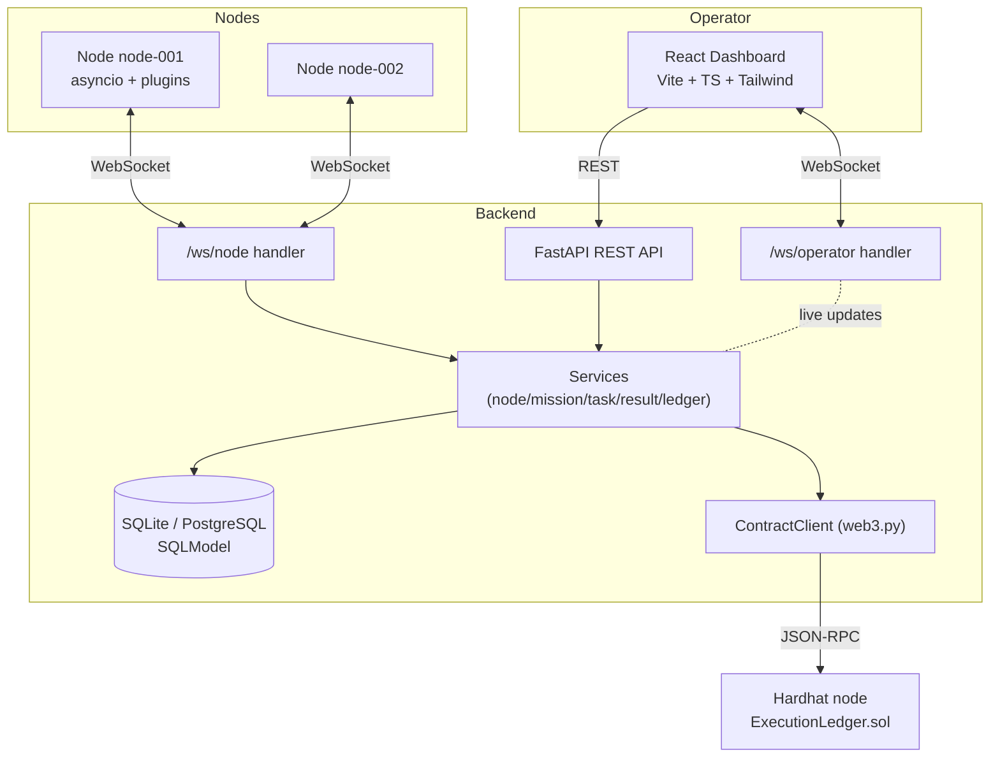
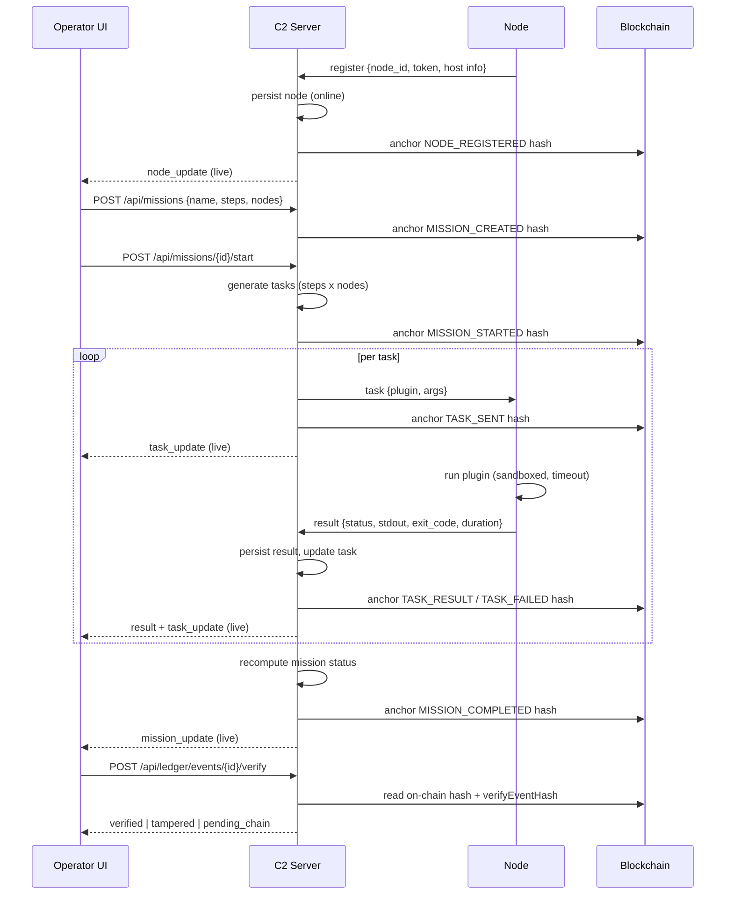

# Architecture

Aligo Mission Ledger C2 is a four-tier system: an operator dashboard, a coordinating C2
server, one or more nodes, and a private blockchain that anchors a tamper-evident ledger.

## Component diagram

## Responsibilities

| Layer | Responsibility |
|-------|----------------|
| Dashboard | Visualize nodes/missions/results, build & start missions, verify ledger, replay timeline. Receives live updates over `/ws/operator`. |
| FastAPI server | REST API, node WebSocket, operator WebSocket, persistence, hashing, ledger chaining, on-chain anchoring, heartbeat monitoring. |
| Services | Pure DB/business logic (no transport). Return data; the async transport layer broadcasts. |
| Node | Connect, register, heartbeat, execute safe plugins, return structured results, auto-reconnect. |
| Blockchain | Immutable store of event hashes + metadata via `ExecutionLedger.sol`. |

## Sequence: operator → server → node → ledger

## Mission flow

1. A mission is a template: `name`, `description`, and an ordered list of `steps`
   (`{plugin, args}`). Predefined missions are seeded at startup (see
   [`server/app/db/seed.py`](../server/app/db/seed.py)).
2. On start, the server resolves target nodes (explicit list, mission default, or all
   connected) and creates one `Task` per `(step x node)`.
3. Tasks are dispatched over the node WebSocket. Each transition is broadcast to operators
   and anchored in the ledger.
4. When all of a mission's tasks reach a terminal state, the mission status is recomputed:
   `completed` (all success), `failed` (all failed), or `partially_failed` (mixed).

## Task flow & states

`pending → sent → (running) → success | failed | timeout`

- `pending`: created, not yet dispatched.
- `sent`: delivered to the node (the node may emit `task_ack`).
- `success` / `failed` / `timeout`: derived from the node's `result` message.
- If the target node is offline at dispatch time, the task is marked `failed` immediately
  so missions never hang (see [`dispatch.py`](../server/app/websocket/dispatch.py)).

## Multi-node handling

- Each node is keyed by a stable `node_id`. Reconnecting with the same id updates the
  existing record (`NODE_RECONNECTED`) rather than creating a duplicate.
- The `ConnectionManager` ([`manager.py`](../server/app/websocket/manager.py)) maps
  `node_id → WebSocket` and tracks operator subscribers.
- A background monitor downgrades nodes by heartbeat age: `warning` after 15s, `offline`
  after 30s (configurable). Status changes are broadcast live.

## Error handling

- All inbound WebSocket messages are size-capped and JSON-validated; bad payloads get an
  `error` message instead of crashing the connection.
- Node registration with a bad token is rejected before any state changes.
- Plugin failures are returned as structured results (`status=failed`, `stderr`, non-zero
  `exit_code`), never as crashes.
- On-chain anchoring is best-effort: if the chain is unreachable, events remain in the DB
  with `onchain_status=pending_chain` and the system keeps running.
- The heartbeat monitor and socket handlers catch and log exceptions defensively so one bad
  actor cannot take down the server.
