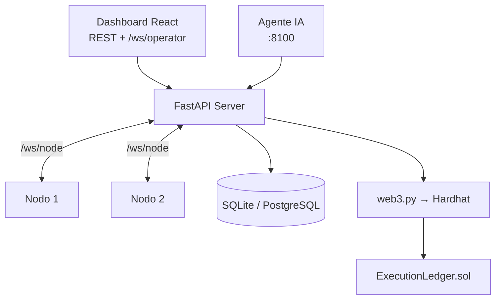

# Arquitectura

Sistema de cuatro capas: dashboard del operador, servidor C2, nodos y blockchain privada
que ancla un ledger a prueba de manipulaciones.

## Diagrama

| Capa | Stack | Rol |
|------|-------|-----|
| Dashboard | React, Vite, TypeScript, Tailwind | Operador: nodos, misiones, ledger, IoT, vulnerabilidades |
| Servidor | Python 3.12, FastAPI, SQLModel | REST, WebSockets, persistencia, ledger, OSINT |
| Nodo | asyncio, websockets | Plugins seguros, heartbeats, firma Ed25519 |
| Agente | LangGraph, Claude | Planifica misiones vía API; aprobación humana |
| Blockchain | Hardhat, Solidity | Ancla hashes de eventos |

## Flujo misión → tarea → ledger

1. El operador crea o elige una **misión** (lista de pasos `{plugin, args}`).
2. Al iniciar, el servidor genera **tareas** (paso × nodo) y las despacha por WebSocket.
3. Cada transición se persiste, se emite por `/ws/operator` y se **ancla** en el ledger.
4. Estados de tarea: `pending → sent → success | failed | timeout | blocked_by_policy`.

## Protocolo nodo ↔ servidor

Transporte: **WebSocket** `/ws/node`, JSON, versión `1.0`.

| Tipo | Dirección | Propósito |
|------|-----------|-----------|
| `register` | nodo → servidor | Autenticación con token compartido |
| `register_ack` | servidor → nodo | Aceptación |
| `heartbeat` | nodo → servidor | Liveness (~5 s) |
| `task` | servidor → nodo | Ejecutar plugin |
| `result` | nodo → servidor | Salida estructurada + firma |
| `error` | ambos | Error no fatal |

Canal operador: `/ws/operator` con eventos `node_update`, `task_update`, `mission_update`,
`vulnerability_scan_update`, `vulnerability_issue`, etc.

## Topología en la UI

La página **Topology** muestra el mapa del laboratorio: operador → servidor → nodos
online → blockchain. Incluye la rama IoT bajo el gateway `gateway-sim-001` con subdispositivos
simulados (sensores y actuadores).

## Manejo de errores

- Mensajes WebSocket con tamaño máximo y validación Pydantic.
- Token inválido en registro → rechazo inmediato.
- Nodo offline al despachar → tarea `failed` (las misiones no cuelgan).
- Cadena caída → eventos `pending_chain`; el sistema sigue operando.

Código de referencia: `server/app/websocket/`, `node/protocol.py`, `server/app/services/`.
