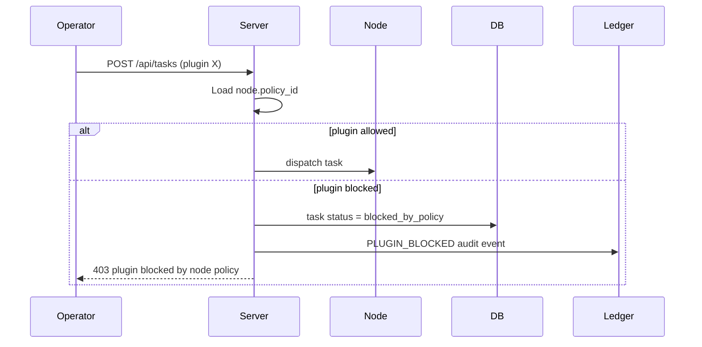

# Node Policies

Execution policies constrain which **safe plugins** a node may run. Policies are enforced **before** a task is dispatched.

## Predefined policies

| ID | Name | Plugins |
|----|------|---------|
| `basic_safe` | Basic Safe Node | `health_check`, `system_info`, `echo` |
| `lab_file_audit` | Lab File Audit | `health_check`, `system_info`, `list_lab_directory` |
| `demo_full` | Demo Full | `health_check`, `system_info`, `network_info`, `list_lab_directory`, `allowed_command` |

Default for new nodes: **`basic_safe`**.

## Assignment

1. Open **Nodes → Node Detail**.
2. Choose a policy from the dropdown.
3. Save — applies immediately to future tasks.

## Enforcement flow



## PLUGIN_BLOCKED audit

When a plugin is denied:

- A task row is created with status **`blocked_by_policy`**
- A ledger event **`PLUGIN_BLOCKED`** is emitted with `plugin`, `policy_id`, and reason
- Timeline replay shows **Plugin blocked by policy**

## Demo: show enforcement

1. Set a node to **Basic Safe Node** (`basic_safe`).
2. From **Console**, run `network_info` on that node.
3. Show **403** message and **`blocked_by_policy`** badge.
4. Open **Ledger** / timeline — **`PLUGIN_BLOCKED`** event.
5. Switch policy to **Demo Full** and retry — task succeeds.

## API

```
GET  /api/policies
GET  /api/policies/{id}
```

## Safety note

Policies are an **additional** layer on top of the global plugin allowlist. They do not grant shell access or offensive capabilities — only subsets of already-safe lab plugins.
