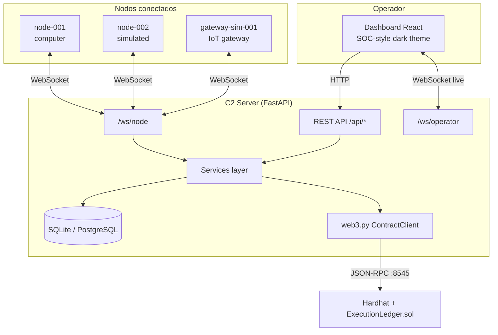
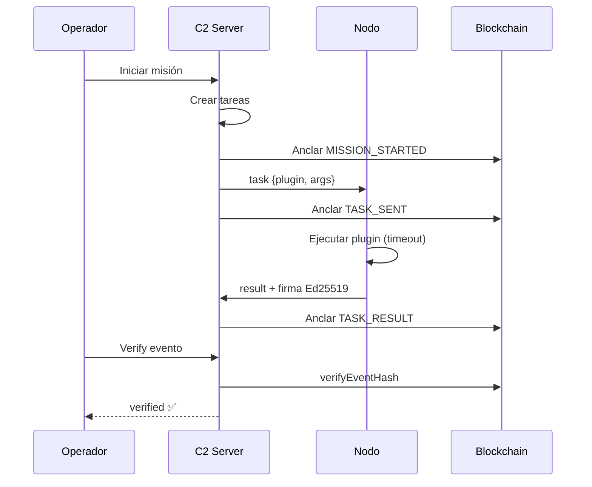

# Aligo Mission Ledger C2 — Documentación general para presentación

> **Propósito de este documento:** Fuente única y detallada para que un asistente (p. ej. Claude) genere una presentación PowerPoint o Google Slides del proyecto. Incluye narrativa, arquitectura, stack, funcionalidades, flujos, demo y mensajes para jurado.
>
> **Proyecto:** Hackathon *Aligo Defensores Informáticos*  
> **Repositorio:** `aligo-c2`  
> **Uso:** Laboratorio autorizado únicamente — no es malware ni herramienta ofensiva.

---

## Índice sugerido para la presentación (≈18–22 diapositivas)

| # | Título sugerido | Contenido clave |
|---|----------------|-----------------|
| 1 | Portada | Aligo Mission Ledger C2 — C2 de laboratorio con ledger blockchain |
| 2 | El problema | Los C2 tradicionales no dejan evidencia verificable de lo ejecutado |
| 3 | Nuestra propuesta | Misiones reutilizables + nodos modulares + prueba de ejecución anclada on-chain |
| 4 | Qué NO es | Sin shell remoto, sin malware, sin exfiltración — laboratorio seguro |
| 5 | Arquitectura general | Dashboard → Server → Nodos → Blockchain |
| 6 | Stack tecnológico | Python/FastAPI, React, Hardhat/Solidity, SQLite |
| 7 | Nodos de laboratorio | Registro, heartbeat, plugins allowlist, políticas |
| 8 | Misiones y tareas | Plantillas, fan-out multi-nodo, estados de tarea |
| 9 | Proof-of-Execution Ledger | Hash SHA-256, cadena `previous_hash`, contrato inteligente |
| 10 | Evidencia y verificación | Modal de evidencia, firmas Ed25519, Merkle, Verifier |
| 11 | Políticas de ejecución | Capas de seguridad: allowlist global + política por nodo |
| 12 | IoT simulado | Gateway software, sensores/actuadores, IoT Lab |
| 13 | Interfaz de operador | Dashboard, Topology, Demo, Ledger, Console |
| 14 | Flujo demo (5 min) | Conectar → misión → evidencia → anclar → verificar → tamper |
| 15 | Innovación técnica | Por qué blockchain aporta valor en un C2 de auditoría |
| 16 | Robustez y calidad | Tests, degradación graceful, reconexión, timeouts |
| 17 | Limitaciones honestas | Local chain, token compartido, no producción |
| 18 | Cierre / visión | Plataforma híbrida: nodos + IoT + evidencia verificable |
| 19 | (Opcional) API y despliegue | REST, WebSockets, Docker, `dev.py` |
| 20 | (Opcional) Preguntas frecuentes del jurado | Respuestas preparadas |

---

## 1. Resumen ejecutivo (elevator pitch)

**Aligo Mission Ledger C2** es una plataforma de **Command & Control (C2) orientada a misiones** para entornos de laboratorio autorizados. En lugar de ser una consola remota genérica, permite:

1. **Definir misiones** reutilizables (secuencias de pasos con plugins seguros).
2. **Orquestar nodos** de laboratorio (equipos simulados o reales) y un **gateway IoT simulado**.
3. **Recibir resultados en tiempo real** vía WebSocket.
4. **Registrar cada evento importante** en un ledger local encadenado criptográficamente.
5. **Anclar hashes en una blockchain privada** (Hardhat) para demostrar que la evidencia no fue alterada.
6. **Verificar integridad** con un clic: estado `verified` vs `tampered`.

**Frase para jurado (30 segundos):**

> *"Mission Ledger C2 convierte operaciones de laboratorio en evidencia auditable. Cada plugin ejecutado en cada nodo genera un paquete de prueba de ejecución — con hash encadenado y anclaje on-chain — para demostrar que nadie modificó los resultados después del hecho."*

**Diferenciador frente a un C2 clásico:**

| C2 clásico | Mission Ledger C2 |
|------------|-------------------|
| Ejecuta comandos | Ejecuta **plugins allowlist** en sandbox |
| Guarda logs editables | **Hashes inmutables** on-chain |
| Consola ad-hoc | **Misiones** versionables y repetibles |
| Un tipo de endpoint | **Nodos de cómputo + gateway IoT** simulado |
| Sin prueba criptográfica | **Verify** recomputa hash y compara con cadena |

---

## 2. Contexto ético y de seguridad (obligatorio en la presentación)

### 2.1 Declaración de uso

- Uso **exclusivo** en laboratorio cerrado y **autorizado**.
- Diseñado para **educación, defensa y demostración** — no para atacar sistemas reales.
- En la UI se usa el término **"nodo"**, nunca "agente" ni lenguaje ofensivo.

### 2.2 Lo que el sistema NO implementa (límites intencionales)

- Sin shell remoto arbitrario.
- Sin malware, implants, persistencia, evasión o bypass de antivirus.
- Sin movimiento lateral real, exfiltración o robo de credenciales.
- Sin escaneo/explotación de redes ajenas.
- Sin ejecución contra sistemas fuera del laboratorio autorizado.

### 2.3 Modelo de contención

1. **Allowlist global de plugins** — validada en API (Pydantic) y en el runtime del nodo.
2. **Políticas por nodo** — subconjuntos del allowlist (`basic_safe`, `demo_full`, `iot_demo_policy`, etc.).
3. **Sandbox de archivos** — `list_lab_directory` solo dentro de `lab_workspace`.
4. **`allowed_command`** — no invoca shell; solo 4 comandos simulados: `whoami`, `hostname`, `pwd`, `date`.
5. **Token compartido** — gate simple de laboratorio (`NODE_SHARED_TOKEN`), no PKI de producción.
6. **Timeouts** — cada tarea tiene límite de tiempo (p. ej. 30 s).
7. **Límite de tamaño** — mensajes WebSocket acotados.

**Mensaje para slide:** *"La seguridad aquí es contención + auditabilidad, no ofuscación ofensiva."*

---

## 3. Arquitectura del sistema

### 3.1 Vista de cuatro capas



### 3.2 Responsabilidades por componente

| Componente | Tecnología | Responsabilidad |
|------------|------------|-----------------|
| **Dashboard** | React 18, Vite, TypeScript, Tailwind CSS | UI del operador: nodos, misiones, ledger, demo, IoT Lab, verificador |
| **C2 Server** | Python 3.12+, FastAPI, SQLModel, asyncio | API REST, WebSockets, persistencia, hashing, ledger, dispatch de tareas |
| **Nodo (computer)** | Python asyncio, websockets | Conexión persistente, heartbeat, ejecución de plugins seguros, firma Ed25519 de resultados |
| **Gateway IoT** | `iot_gateway.py` + `iot_sim/` | Mismo canal WS; enruta plugins a subdispositivos simulados en memoria |
| **Blockchain** | Hardhat, Solidity 0.8, contrato `ExecutionLedger` | Almacén append-only de hashes de eventos |
| **Puente** | web3.py | Registrar y leer eventos on-chain desde el servidor |
| **Base de datos** | SQLite (default) / PostgreSQL | Nodos, misiones, tareas, resultados, eventos de ledger |

### 3.3 Canales de comunicación

| Canal | URL | Quién | Para qué |
|-------|-----|-------|----------|
| REST | `http://localhost:8000/api/*` | Dashboard | CRUD nodos, misiones, tareas, ledger, evidencia, IoT |
| WebSocket operador | `ws://localhost:8000/ws/operator` | Dashboard | Actualizaciones live: `node_update`, `task_update`, `result`, `ledger_event`, `iot_telemetry` |
| WebSocket nodo | `ws://localhost:8000/ws/node` | Procesos `node.py` / `iot_gateway.py` | Registro, heartbeat, recepción de tareas, envío de resultados |
| JSON-RPC | `http://localhost:8545` | Servidor ↔ Hardhat | Transacciones del contrato |

### 3.4 Estructura de carpetas del repositorio

```
aligo-c2/
├── server/           # Backend FastAPI
│   └── app/
│       ├── api/      # Routers REST (nodes, missions, tasks, ledger, demo, iot, evidence)
│       ├── core/     # Enums, hashing, signing, merkle, policies, config
│       ├── models/   # SQLModel ORM
│       ├── schemas/  # Pydantic request/response
│       ├── services/ # Lógica de negocio
│       ├── websocket/# node_socket, operator_socket, dispatch
│       └── blockchain/
├── node/             # Runtime del nodo Python
│   ├── plugins/      # Plugins de cómputo (health_check, system_info, …)
│   ├── iot_sim/      # Estado simulado de subdispositivos IoT
│   ├── iot_gateway.py
│   └── node.py
├── frontend/         # Dashboard React
│   └── src/
│       ├── pages/    # Dashboard, Nodes, Missions, Ledger, Demo, IoT Lab, …
│       └── components/
├── blockchain/       # Hardhat + ExecutionLedger.sol
├── docs/             # Documentación técnica y de demo
├── demo/             # Scripts de demo, misiones de ejemplo, reportes exportados
├── dev.py            # Launcher todo-en-uno del stack local
└── docker-compose.yml
```

---

## 4. Stack tecnológico detallado

### 4.1 Backend (Python)

| Paquete / herramienta | Uso |
|----------------------|-----|
| **FastAPI** | Framework HTTP + WebSocket |
| **Uvicorn** | Servidor ASGI |
| **SQLModel** | ORM sobre SQLAlchemy + validación Pydantic |
| **Pydantic v2** | Schemas de API y mensajes WS |
| **websockets** (lado servidor vía Starlette) | Conexiones persistentes |
| **web3.py** | Cliente Ethereum para Hardhat |
| **cryptography / Ed25519** | Verificación de firmas de nodos |
| **pytest** | Tests automatizados (hashing, ledger, plugins, evidencia) |

### 4.2 Frontend (TypeScript)

| Paquete | Uso |
|---------|-----|
| **React 18** | UI componentizada |
| **Vite** | Build y dev server (:5173) |
| **TypeScript** | Tipado estricto |
| **Tailwind CSS** | Estilo SOC oscuro (panel, bordes, badges) |
| **React Router** | Navegación multi-página |

### 4.3 Blockchain

| Elemento | Detalle |
|----------|---------|
| **Hardhat** | Nodo local EVM en puerto 8545 |
| **Solidity** | Contrato `ExecutionLedger.sol` |
| **deployment.json** | Dirección del contrato desplegado (raíz del repo) |
| **Clave demo** | Clave Hardhat pública conocida — solo local |

### 4.4 Nodo Python

| Elemento | Detalle |
|----------|---------|
| **asyncio** | Loop principal del nodo |
| **websockets** | Cliente hacia `/ws/node` |
| **plugins** | Funciones Python registradas por nombre |
| **identity.py / signing.py** | Par Ed25519 por `node_id` |
| **reconexión** | Backoff exponencial ante desconexión |

### 4.5 Despliegue y desarrollo

| Método | Comando / notas |
|--------|-----------------|
| **Todo en uno** | `python dev.py` — chain, deploy, API, frontend, 3 nodos, gateway IoT |
| **Docker Compose** | `docker compose up --build` |
| **Manual** | Terminales separadas: hardhat node → deploy → uvicorn → npm run dev → node.py |
| **Variables** | `.env` desde `.env.example`: `NODE_SHARED_TOKEN`, `CONTRACT_ADDRESS`, `DATABASE_URL`, `BLOCKCHAIN_RPC_URL` |

---

## 5. Conceptos del dominio

### 5.1 Nodo (Node)

Un **nodo** es un proceso Python que se conecta al C2 por WebSocket. No se crea desde la UI: **aparece al conectarse**.

**Campos del registro:**

- `id` — identificador estable (`node-001`, `gateway-sim-001`)
- `hostname`, `os`, `username`
- `status` — `online`, `offline`, `warning`, `error`
- `health_score` — 0–100 con desglose explicable
- `alias`, `tags`, `group`, `description` — metadata editable por operador
- `enabled`, `trusted` — flags operativos
- `node_type` — `real`, `simulated`, `computer_node`, `iot_gateway`, `iot_sensor`, `iot_actuator`, `ai_analyst`
- `policy_id` — política de plugins permitidos
- `public_key`, `fingerprint` — identidad criptográfica Ed25519
- `iot_snapshot`, `iot_devices` — estado IoT (solo gateway)

**Heartbeat:** cada ~5 s el nodo envía latido; el servidor actualiza `last_seen` y puede degradar a `warning`/`offline` si expira.

### 5.2 Misión (Mission)

Plantilla reutilizable:

```json
{
  "name": "Lab Health Check",
  "description": "…",
  "steps": [
    { "plugin": "health_check", "args": {} },
    { "plugin": "system_info", "args": {} }
  ]
}
```

**Misiones predefinidas (8):**

| ID | Nombre | Enfoque |
|----|--------|---------|
| `mission-lab-health-check` | Lab Health Check | Salud + system_info en todos los nodos |
| `mission-basic-recon` | Basic Recon | system_info + network_info |
| `mission-directory-audit` | Directory Audit | list_lab_directory |
| `mission-multi-node-ping` | Multi-Node Ping | echo + health_check |
| `mission-iot-lab-health` | IoT Lab Health Check | gateway_health, list_devices, snapshot |
| `mission-iot-environmental` | Environmental Snapshot | 4 sensores simulados |
| `mission-iot-led-proof` | LED Proof Mission | led_on, led_blink, led_off |
| `mission-iot-hybrid` | Hybrid Mission | computer + IoT con `node_id` por paso |

**Estados de misión:** `draft` → `running` → `completed` | `failed` | `partially_failed`

Al completar, se calcula **Merkle root** de las evidencias de la misión (prueba de conjunto).

### 5.3 Tarea (Task)

Una tarea es **una ejecución concreta** de un plugin en un nodo.

**Generación:** al iniciar misión → un task por cada `(paso × nodo objetivo)`, salvo misiones híbridas con `node_id` por paso.

**Estados:** `pending` → `sent` → `running` → `success` | `failed` | `timeout` | `blocked_by_policy`

### 5.4 Resultado (Result)

Respuesta estructurada del nodo:

- `stdout`, `stderr`, `exit_code`, `duration_ms`
- `result_metadata` — p. ej. `evidence_type: iot_action`, `device_id`
- `node_signature` — firma Ed25519 del payload canónico
- `signature_status` — `valid` | `invalid` | `missing`

### 5.5 Evento de ledger (Ledger Event)

Cada hito operativo genera un evento con:

- `event_type` — ver tabla abajo
- `payload` — JSON canónico completo (off-chain)
- `payload_hash` — SHA-256 del JSON canónico
- `previous_hash` — hash del evento anterior (cadena)
- `onchain_status` — `pending_chain` | `anchored` | `disabled`
- `tx_hash`, `block_number` — si se ancló on-chain

**Tipos de evento:**

| EventType | Cuándo |
|-----------|--------|
| `NODE_REGISTERED` | Primer registro del nodo |
| `NODE_RECONNECTED` | Reconexión con mismo id |
| `NODE_DISCONNECTED` | Socket cerrado |
| `MISSION_CREATED` | Nueva misión |
| `MISSION_STARTED` | Inicio de ejecución |
| `TASK_SENT` | Tarea enviada al nodo |
| `TASK_RESULT` | Resultado exitoso |
| `TASK_FAILED` | Fallo o timeout |
| `MISSION_COMPLETED` | Misión terminada |
| `MISSION_MERKLE_ROOT` | Raíz Merkle de la misión |
| `PLUGIN_BLOCKED` / `POLICY_BLOCKED` | Plugin denegado por política |

---

## 6. Plugins seguros (allowlist completa)

### 6.1 Plugins de nodo de cómputo (6)

| Plugin | Descripción | Args típicos |
|--------|-------------|--------------|
| `health_check` | Comprueba que el runtime responde | `{}` |
| `system_info` | OS, hostname, arquitectura | `{}` |
| `echo` | Devuelve texto de prueba | `{"text": "ping"}` |
| `list_lab_directory` | Lista sandbox `lab_workspace` | `{"path": "."}` |
| `network_info` | Interfaces de red locales | `{}` |
| `allowed_command` | Solo whoami/hostname/pwd/date | `{"command": "whoami"}` |

### 6.2 Plugins IoT (12) — gateway `gateway-sim-001`

| Plugin | Nivel | Descripción |
|--------|-------|-------------|
| `gateway_health` | Gateway | Estado del gateway simulado |
| `list_devices` | Gateway | Lista subdispositivos |
| `get_device_info` | Gateway | Info de un `device_id` |
| `get_gateway_snapshot` | Gateway | Snapshot completo |
| `read_temperature` | Dispositivo | Sensor `temp-001` |
| `read_humidity` | Dispositivo | Sensor `humidity-001` |
| `read_motion` | Dispositivo | Sensor `motion-001` |
| `read_light` | Dispositivo | Sensor `light-001` |
| `led_on` | Actuador | Enciende `led-001` |
| `led_off` | Actuador | Apaga LED |
| `led_blink` | Actuador | Parpadeo con `duration_ms`, `interval_ms` |
| `led_set_brightness` | Actuador | Brillo 0–100 |

### 6.3 Políticas predefinidas (4)

| ID | Plugins permitidos |
|----|-------------------|
| `basic_safe` | health_check, system_info, echo |
| `lab_file_audit` | + list_lab_directory |
| `demo_full` | + network_info, allowed_command |
| `iot_demo_policy` | Los 12 plugins IoT |

Política por defecto de nodos nuevos: **`basic_safe`**. Gateway IoT: **`iot_demo_policy`**.

---

## 7. Proof-of-Execution Ledger (núcleo innovador)

### 7.1 Problema que resuelve

En un C2 tradicional, un operador (o atacante con acceso al servidor) puede **editar la base de datos** y cambiar resultados. El ledger añade una **segunda fuente de verdad**: la blockchain privada guarda solo el **hash**, no el contenido sensible.

### 7.2 Flujo de hashing

1. Construir payload canónico (claves ordenadas, JSON determinista).
2. `payload_hash = SHA-256(utf8(json_canónico))`.
3. Encadenar: cada evento incluye `previous_hash` del anterior.
4. Llamar `registerEvent(...)` en `ExecutionLedger.sol` con `bytes32` del hash.
5. Guardar en DB el payload completo + metadata de transacción.

### 7.3 On-chain vs off-chain

| On-chain (contrato) | Off-chain (SQLite) |
|---------------------|-------------------|
| eventId, missionId, taskId, nodeId | stdout, stderr completos |
| eventType | Payload JSON completo |
| payloadHash, previousHash | tx_hash, block_number |
| timestamp | sequence, timestamps ISO |

**Nada de stdout ni secretos va on-chain** — solo huellas criptográficas.

### 7.4 Verificación

`POST /api/ledger/events/{id}/verify`:

1. Recomputar hash desde payload almacenado → `local_match`
2. Leer hash on-chain → `chain_match`
3. Veredicto: **`verified`** | **`tampered`** | **`pending_chain`**

**Demo de tamper:** el endpoint `/api/demo/simulate-tamper` altera una copia local del payload para demostrar que Verify detecta **`tampered`** sin tocar la salida real del nodo.

### 7.5 Diagrama de secuencia (para slide animado)



---

## 8. Evidencia avanzada (más allá del hash básico)

### 8.1 Task Execution Evidence (modal)

Paquete unificado por tarea:

- Identidad: nodo, misión, plugin, args
- Ejecución: stdout, stderr, exit_code, duration_ms
- Integridad: local_hash, previous_hash, integrity_status
- On-chain: tx_hash, block_number, on_chain_status
- **Firma del nodo:** public_key, fingerprint, node_signature, signature_status
- **Política:** policy_decision (PDR — Policy Decision Record)
- **Merkle:** mission_merkle_root, merkle_proof, merkle_proof_status
- **Cadena de custodia:** pasos timestamped desde creación hasta anclaje
- **IoT (si aplica):** gateway, subdevice, physical_style_action, evidence_class `iot_action`
- **anchored_snapshot** — snapshot al momento del anclaje (para diff en verify)

**API:** `GET /api/tasks/{id}/evidence` y `GET /api/tasks/{id}/evidence/bundle`

### 8.2 Firmas Ed25519 del nodo

Cada nodo genera un par de claves persistente (`node/identities/`). Al enviar un `result`, firma un payload canónico. El servidor **rechaza** resultados con firma inválida (`ResultRejected`).

**Valor para presentación:** prueba de que el resultado provino del nodo con esa identidad, no solo del operador.

### 8.3 Merkle root de misión

Al completar una misión, las evidencias de sus tareas se agregan en un **árbol Merkle**. La raíz puede anclarse como evento `MISSION_MERKLE_ROOT`.

**Valor:** verificar integridad del **conjunto** de tareas de una misión, no solo una tarea aislada.

### 8.4 Evidence Verifier (página independiente)

Ruta: **/evidence-verifier**

- Pegar o subir JSON de evidence bundle.
- `POST /api/evidence/verify` recomputa hashes, verifica firma, Merkle y anclaje.
- Devuelve checks individuales y **diff** si hay tampering respecto al snapshot anclado.

**Mensaje jurado:** *"Puedes verificar evidencia fuera del dashboard — no hay que confiar ciegamente en la UI."*

### 8.5 Dry-run de misión

`POST /api/missions/{id}/dry-run` — simula evaluación de políticas y ledger sin despachar tareas. Útil para validar antes de ejecutar misiones híbridas.

---

## 9. IoT simulado (extensión híbrida)

### 9.1 Narrativa

> *"Mission Ledger C2 puede orquestar no solo nodos de cómputo, sino también gateways IoT simulados con sensores y actuadores. Cada acción física simulada — leer temperatura, encender un LED — queda registrada como evidencia verificable anclada on-chain."*

### 9.2 Arquitectura gateway

```
C2 Server
  └── WebSocket /ws/node
        └── gateway-sim-001 (proceso Python real)
              ├── led-001      (actuador)
              ├── temp-001     (sensor)
              ├── humidity-001 (sensor)
              ├── motion-001   (sensor)
              └── light-001    (sensor)
```

- El **gateway es un nodo real** conectado al backend.
- Los **subdispositivos viven en memoria** (`GatewayDeviceStore`).
- Telemetría se actualiza cada ~2 s en un hilo background.
- Heartbeats incluyen `iot_snapshot` → UI recibe `iot_telemetry` live.

### 9.3 Página IoT Lab (`/iot-lab`)

| Sección | Contenido |
|---------|-----------|
| Gateway summary | Estado, salud, política, último heartbeat, badge "simulated" |
| Telemetry | Temperatura, humedad, movimiento, lux |
| Device cards | Estado JSON por subdispositivo |
| Quick actions | LED on/off/blink, refresh sensors, health check, snapshot |
| Circuit View | SVG animado: MCU + resistencia + LED-001 + iconos sensores |
| Event stream | Últimas acciones IoT / resultados |

### 9.4 Qué es real vs simulado

| Real | Simulado |
|------|----------|
| Conexión WS, tareas, resultados, ledger | Hardware físico |
| Proceso gateway | Lecturas de sensores reales |
| Firmas y hashes | Parpadeo físico del LED |

---

## 10. Interfaz de usuario (mapa de páginas)

| Ruta | Nombre | Función principal |
|------|--------|-------------------|
| `/` | Dashboard | Resumen: nodos online, misiones, actividad reciente |
| `/nodes` | Nodes | Tabla/cards del registro de nodos |
| `/nodes/:id` | Node Detail | Metadata, política, salud desglosada, historial de tareas |
| `/topology` | Topology | Vista arquitectura: operador → C2 → nodos + rama IoT → ledger |
| `/iot-lab` | IoT Lab | Laboratorio IoT simulado |
| `/missions` | Missions | Biblioteca, inicio, dry-run, export report |
| `/console` | Console | Consola segura: `run health_check on all`, historial |
| `/ledger` | Ledger | Lista de eventos, anchor, verify |
| `/evidence-verifier` | Verifier | Verificación independiente de bundles JSON |
| `/demo` | Demo | Botones grandes para jurado + checklist 5 pasos + panel IoT |

**Estilo visual:** tema oscuro SOC, badges de estado (`online`, `verified`, `tampered`), fuente mono para hashes.

---

## 11. Flujos operativos (para slides de proceso)

### 11.1 Flujo estándar de misión

1. Operador abre **Nodes** — confirma nodos `online`.
2. **Missions** — selecciona misión y nodos objetivo.
3. **Start** — servidor crea tareas y despacha por WebSocket.
4. Dashboard recibe updates live — sin refrescar página.
5. Cada resultado abre **Task Execution Evidence**.
6. **Ledger** — revisar eventos; **Anchor pending** si hace falta.
7. **Verify** — demostrar `verified`.

### 11.2 Flujo demo rápido (5 minutos) — jurado

| Min | Acción | Página |
|-----|--------|--------|
| 0:00 | Mostrar stack conectado | Dashboard / Topology |
| 0:30 | `python dev.py` o nodos ya online | Terminal (opcional) |
| 1:00 | Start sample mission | Demo |
| 2:00 | Abrir evidencia de una tarea | Evidence modal |
| 2:30 | Política: network_info bloqueado en basic_safe | Console + Node Detail |
| 3:30 | Anchor pending + Verify latest | Demo / Ledger |
| 4:00 | Simulate tamper → Verify → tampered | Demo |
| 4:30 | IoT: blink LED + IoT Lab circuit | Demo / IoT Lab |
| 5:00 | Export mission report MD | Demo |

### 11.3 Flujo IoT (3 minutos adicionales)

1. Abrir **IoT Lab** — telemetría live.
2. **Blink LED** — ver animación en Circuit View.
3. Ejecutar **Environmental Snapshot** desde Missions o Demo.
4. **Verify latest IoT event** — misma cadena de evidencia que nodos de cómputo.
5. **Hybrid Mission** — un paso en `node-001` y pasos en `gateway-sim-001`.

---

## 12. API REST (referencia resumida)

| Grupo | Endpoints destacados |
|-------|---------------------|
| Meta | `GET /health` |
| Nodes | `GET/PATCH/DELETE /api/nodes`, `GET /api/nodes/{id}/detail` |
| Policies | `GET /api/policies` |
| Missions | `GET/POST /api/missions`, `POST .../start`, `POST .../dry-run`, `GET .../report` |
| Tasks | `GET/POST /api/tasks`, `GET .../evidence`, `GET .../evidence/bundle` |
| Results | `GET /api/results` |
| Ledger | `GET /api/ledger/events`, `POST .../verify`, `POST .../anchor`, `POST /api/ledger/anchor-pending` |
| Evidence | `POST /api/evidence/verify` |
| IoT | `GET /api/iot/lab`, `POST /api/iot/actions` |
| Demo | `POST /api/demo/start-sample-mission`, `start-iot-health-check`, `blink-led`, `simulate-tamper`, `export-iot-evidence`, … |

Documentación interactiva: **http://localhost:8000/docs** (Swagger).

---

## 13. Protocolo WebSocket (resumen)

**Primer mensaje del nodo:** `register` con `token`, `node_id`, metadata.

**Mensajes clave:**

- `heartbeat` — latido (+ `iot_snapshot` en gateway)
- `task` — servidor → nodo: `{task_id, mission_id, plugin, args}`
- `result` — nodo → servidor: status, stdout, firma, metadata

**Operador recibe:** `node_update`, `task_update`, `result`, `mission_update`, `ledger_event`, `iot_telemetry`.

Versión de protocolo: **1.0**. Detalle completo en [`protocol.md`](protocol.md).

---

## 14. Robustez y calidad de ingeniería

| Aspecto | Implementación |
|---------|----------------|
| Blockchain caída | Eventos `pending_chain`; sistema sigue operando |
| Nodo offline al dispatch | Tarea `failed` inmediato — misión no cuelga |
| Reconexión nodo | Mismo `node_id` → `NODE_RECONNECTED` |
| Heartbeat monitor | Degradación warning/offline automática |
| Validación entrada | Pydantic en REST y WS; frames size-capped |
| Tests | pytest: hashing, ledger, plugins, traversal, evidencia |
| Frontend | `tsc --noEmit` limpio; build Vite |
| Separación capas | Services sin transporte; WS/API solo orquestan |

---

## 15. Limitaciones (transparencia para jurado)

- **No es producción** — demo/hackathon.
- **Blockchain local** — Hardhat, no red pública descentralizada.
- **Token simétrico** — no PKI/mTLS.
- **Sin TLS por defecto** — localhost/LAN de confianza.
- **SQLite** — un escritor; PostgreSQL soportado vía `DATABASE_URL`.
- **Plugins limitados** — por diseño ético.
- **Servidor single-instance** — sin cluster ni bus de mensajes.

Ver [`limitations.md`](limitations.md).

---

## 16. Argumentos para criterios de evaluación (hackathon)

### Innovación técnica
- Ledger de prueba de ejecución con verificación real on-chain.
- Firmas de nodo + Merkle + verifier independiente.
- Extensión IoT con misma tubería de evidencia.

### Funcionalidad
- MVP end-to-end: nodos, misiones, resultados live, ledger, IoT, export.
- 8 misiones predefinidas, 18 plugins, 4 políticas, 10 páginas de UI.

### Robustez
- Degradación graceful, timeouts, tests automatizados.

### Calidad de código
- Type hints, SQLModel, React tipado, docs extensas.

### Presentación
- Página Demo dedicada, Topology, IoT Lab visual, scripts temporizados.

### Uso responsable
- Allowlist, sin shell, documentación de límites explícita.

---

## 17. Preguntas frecuentes del jurado (respuestas preparadas)

**¿Es malware?**  
No. Es un C2 de laboratorio con plugins informativos allowlist. No hay capacidades ofensivas.

**¿Por qué blockchain y no solo logs?**  
Porque el operador controla la DB. El hash on-chain es una segunda fuente de verdad inmutable para detectar alteraciones posteriores.

**¿Qué pasa si no hay blockchain?**  
El sistema funciona; los eventos quedan `pending_chain` o `local_only`.

**¿Los nodos IoT son reales?**  
El gateway es un proceso real conectado al C2; sensores y LED son estado simulado en software — adecuado para demo sin hardware.

**¿Se puede escalar a producción?**  
No está diseñado para ello. Haría falta mTLS, PKI, cola de anclaje, HSM, PostgreSQL, TLS, y revisión de seguridad formal.

**¿Cómo añado un plugin?**  
Implementar en `node/plugins/`, registrar en el nodo, añadir a `ALLOWED_PLUGINS` en servidor y opcionalmente a una política.

---

## 18. Textos listos para copiar en diapositivas

### Título portada
**Aligo Mission Ledger C2**  
*Orquestación de laboratorio con evidencia verificable on-chain*

### Subtítulo
Nodos modulares · Misiones reutilizables · Ledger blockchain · IoT simulado

### Bullets "Características"
- Dashboard SOC en tiempo real (WebSocket)
- 8 misiones predefinidas + constructor custom
- 18 plugins seguros (cómputo + IoT)
- Ledger SHA-256 encadenado + contrato Solidity
- Verificación one-click: verified / tampered
- Firmas Ed25519, Merkle root, verifier independiente
- Políticas por nodo y auditoría PLUGIN_BLOCKED
- IoT Lab con circuito LED animado

### Cierre
> *De consola remota a plataforma de operaciones auditable — en un laboratorio seguro, demostrable y verificable.*

---

## 19. Enlaces a documentación especializada

| Tema | Archivo |
|------|---------|
| Arquitectura | [`architecture.md`](architecture.md) |
| Protocolo WS | [`protocol.md`](protocol.md) |
| Seguridad | [`security.md`](security.md) |
| Ledger blockchain | [`blockchain-ledger.md`](blockchain-ledger.md) |
| Registro de nodos | [`node-registry.md`](node-registry.md) |
| Políticas | [`node-policies.md`](node-policies.md) |
| Evidencia de tareas | [`task-evidence.md`](task-evidence.md) |
| Export informes | [`mission-report.md`](mission-report.md) |
| Demo tamper | [`tamper-demo.md`](tamper-demo.md) |
| Topología UI | [`topology.md`](topology.md) |
| IoT simulado | [`iot-simulation.md`](iot-simulation.md) |
| Arquitectura IoT | [`iot-architecture.md`](iot-architecture.md) |
| Script demo IoT | [`iot-demo-script.md`](iot-demo-script.md) |
| Script demo general | [`demo-script.md`](demo-script.md) |
| Despliegue | [`deployment.md`](deployment.md) |
| Estrategia scoring | [`scoring-strategy.md`](scoring-strategy.md) |
| Limitaciones | [`limitations.md`](limitations.md) |

---

## 20. Instrucciones para generar la PPT (prompt sugerido para Claude)

Al pedir la presentación, puedes usar:

```
Usa el archivo docs/presentacion-general.md como única fuente.
Genera una presentación de 18–20 diapositivas en español para jurado técnico.
Incluye: portada, problema, solución, arquitectura (diagrama), stack, demo flow,
ledger/verify, IoT, seguridad ética, limitaciones, cierre.
Estilo: profesional, dark/cyber SOC, pocos bullets por slide, notas del presentador al pie.
Añade 1 slide con screenshot placeholders descritos (Dashboard, Evidence modal, IoT Lab, Verify tampered).
```

---

*Documento generado para el repositorio Aligo Mission Ledger C2. Actualizar cuando cambien misiones, plugins o páginas de la UI.*
